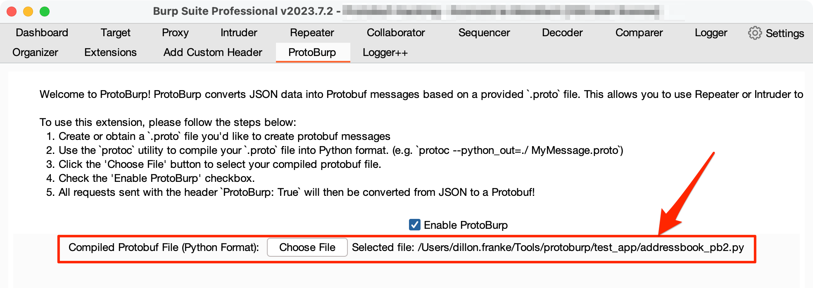
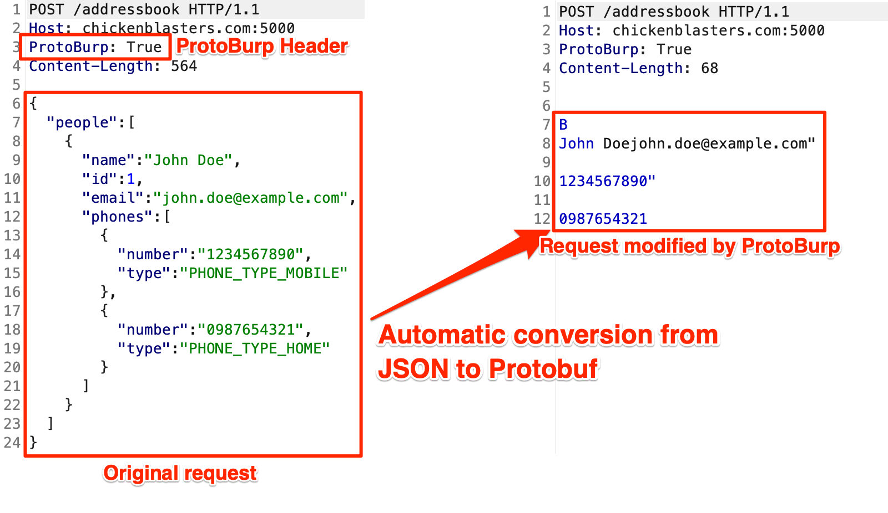

# ProtoBurp
Check out my blog post detailing the wonderful things you can do with `ProtoBurp`! [https://dillonfrankesecurity.com/posts/protoburp-encode-custom-protobuf-messages-in-burp/](https://dillonfrankesecurity.com/posts/protoburp-encode-custom-protobuf-messages-in-burp/)

## Description
`ProtoBurp` is a Burp Suite extension that enables security researchers to encode and fuzz custom Protobuf messages. It allows users to automatically convert JSON data into a Protobuf message based on a provided protobuf definition file. This opens up opportunities for fuzzing inputs using Burp's Repeater and Intruder tools, as well as proxy traffic from other tools (e.g. `sqlmap`).

## Installation

### 1. Clone the `ProtoBurp` repository and its submodules
```bash
git clone --recursive https://github.com/dillonfranke/protoburp.git
```
> Make sure to add the `--recursive` option
### 2. Install the `protoc` utility, which you'll need to compile Protobuf defintion (`.proto`) files
Mac:
```bash
brew install protobuf
```
Debian Linux:
```bash
sudo apt-get update
sudo apt-get install protobuf-compiler
```
Windows:
https://github.com/protocolbuffers/protobuf/releases

### 3. Run the `setup.sh` script
This will install Google's `protobuf` module so it can be used by the extension
```bash
chmod +x ./setup.sh
./setup.sh
```

## Usage

### 1. Compile the `.proto` file you want to convert into Python format
> Several example `.proto` files are contained in the `test_app` folder
```bash
protoc --python_out=. addressbook.proto
```

### 2. Load the `ProtoBurp` extension and select your compiled `.proto` file
- Click 'Enable ProtoBurp'
- Select the Python Protobuf definition file you just compiled



### 3. Set the `ProtoBurp` header on your requests, and your requests will be transformed from JSON to Protobuf!


### Generating a JSON payload
You might be wondering: "How can I generate a JSON object from a `.proto` file to use with `ProtoBurp`?"

Easy, I wrote a script that, given a `.proto` file, will fill in placeholder values to generate a JSON payload. You can then use the JSON payload with `ProtoBurp`. Here's how you use the script:

```bash
❯ python3 json-generator.py
Usage: python3 json-generator.py <compiled_proto_definition_pb2.py> <MessageName>
```
```bash
❯ python3 json-generator.py test_app/addressbook_pb2.py AddressBook
{
  "people": [
    {
      "name": "example",
      "id": 1,
      "email": "example",
      "phones": [
        {
          "number": "example",
          "type": "PHONE_TYPE_UNSPECIFIED"
        },
        {
          "number": "example",
          "type": "PHONE_TYPE_UNSPECIFIED"
        }
      ]
    },
    {
      "name": "example",
      "id": 1,
      "email": "example",
      "phones": [
        {
          "number": "example",
          "type": "PHONE_TYPE_UNSPECIFIED"
        },
        {
          "number": "example",
          "type": "PHONE_TYPE_UNSPECIFIED"
        }
      ]
    }
  ]
}
```

## Use Cases
Please see my [blog post](https://dillonfrankesecurity.com/posts/protoburp-encode-custom-protobuf-messages-in-burp/), where I talk about how you can use `ProtoBurp` with Repeater, Intruder, and external security utilities like `sqlmap`!

## Bugs and Feature Requests
Please use the [issues tab](https://github.com/dillonfranke/protoburp/issues) for any bugs or feature requests.

Happy Hunting!